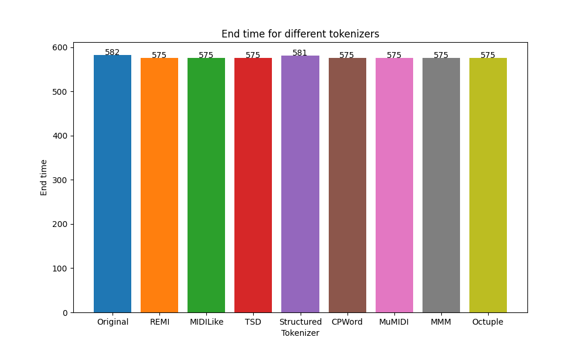
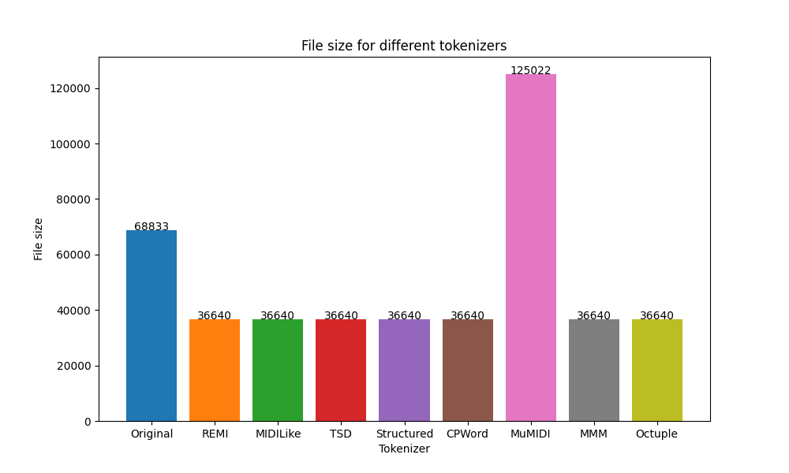
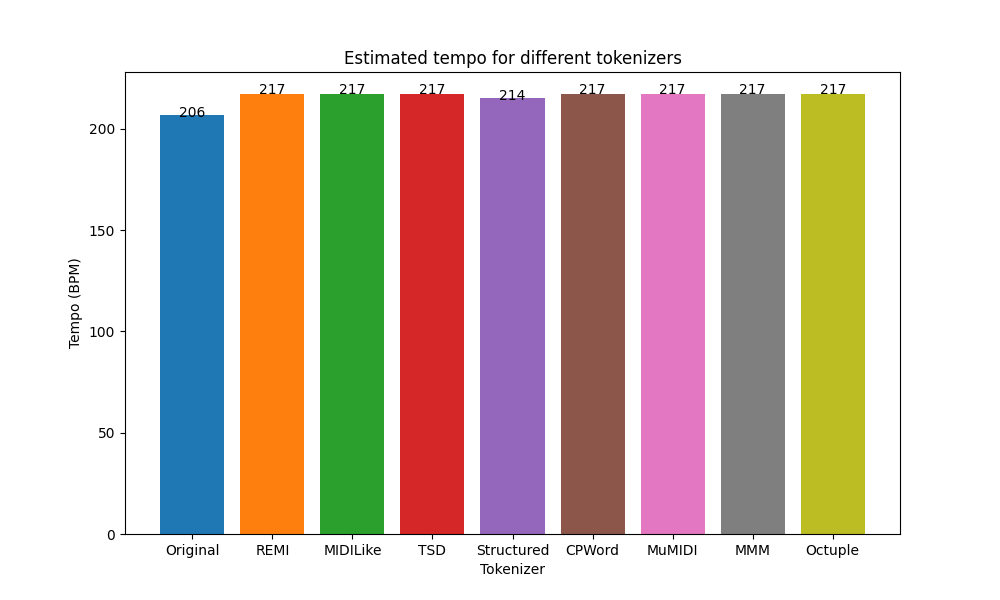

**11.03 - 17.03 - Przegląd literatury, przegląd podobnych implementacji, przygotowanie danych:**

W ramach przęglądu istniejących rozwiązań znaleziono narzędzia:
* MuseAI (https://github.com/webpolis/musai) 
* Musicaiz (https://github.com/carlosholivan/musicaiz)

W ramach przęglądu literatury znaleziono poniższe pozycje:
* Przegląd metryk ewaluacyjnych (https://dawenl.github.io/publications/Raffel14-mireval.pdf)
* GANSynth - Generacja muzyki w formacie symbolicznym (https://arxiv.org/pdf/1902.08710.pdf)

Przygotowanie danych:
Znalezione datasety:
* JS Bach Chorales (https://arxiv.org/abs/1206.6392)
* JS Bach Fakes (https://arxiv.org/abs/2107.10388)
* Lakh MIDI Dataset (LMD) (https://colinraffel.com/publications/thesis.pdf)
* MAESTRO (https://arxiv.org/abs/1810.12247)
* Slakh2100 (https://ieeexplore.ieee.org/abstract/document/8937170)
* Meta-MIDI Dataset (https://archives.ismir.net/ismir2021/paper/000022.pdf)
Nie podjęto jeszcze decyzji, który dataset będzie wykorzystywany. Skłaniamy się ku Maestro i Meta-MIDI Dataset.

**18.03 - 24.03 - implementacja technik tokenizacji, testowanie**
* stworzenie pliku do odczytywanie plików MIDI
* stworzenie pliku odpowiedzialnego za wybór tokenizacji i parametrów tokenizacji
* testowanie stworzonych plików

Obserwacje: po konwersji na plik MIDI po tokenizacji widać, że zaszła kompresja:
PRZED: Score(ttype=Tick, **tpq=384**, begin=0, *end=447165*, tracks=1, notes=4991, time_sig=1, key_sig=0, markers=0, lyrics=0)
PO: Score(ttype=Tick, **tpq=8**, begin=0, *end=9302*, tracks=1, notes=4991, time_sig=1, key_sig=0, markers=0, lyrics=0)

**25.03 - 31.03 - Stworzenie pierwszego modelu, szkolenie modelu, ocena szkolenia,
konsultacja wyników z prowadzącym**
* rozpoczęto zadania zaplanowane na przyszłe iteracje po reewaluacji planu rozwoju projektu - skonfigurowano 
 konteneryzację przy pomocy Dockera, zainicjalizowano frontend
* stworzenie modelu zajmie prawdopodbniej więcej czasu, niż zakładano, przerwa świąteczna jest potrzebna tydzień wcześniej

**01.04 - 07.04**
* Po części przerwa swiąteczna, pierwsze koncepcje frontendu, konsultacja z prowadzącym odnośnie sposobu generacji muzyki -> konieczna zmiana podejścia i pierwsze próby korzystania z nanoGPT
* Dodanie odtwarzania muzyki z midi zakończone niepowodzeniem -> modyfikacja pipeline'u pracy z dockerem

**15.04 - 21.04**
* przygotowanie plików do zapisu plików MIDI po tokenizacji

**22.04 - 28.04**
* analiza wpływu tokenizatorów na pliki MIDI

